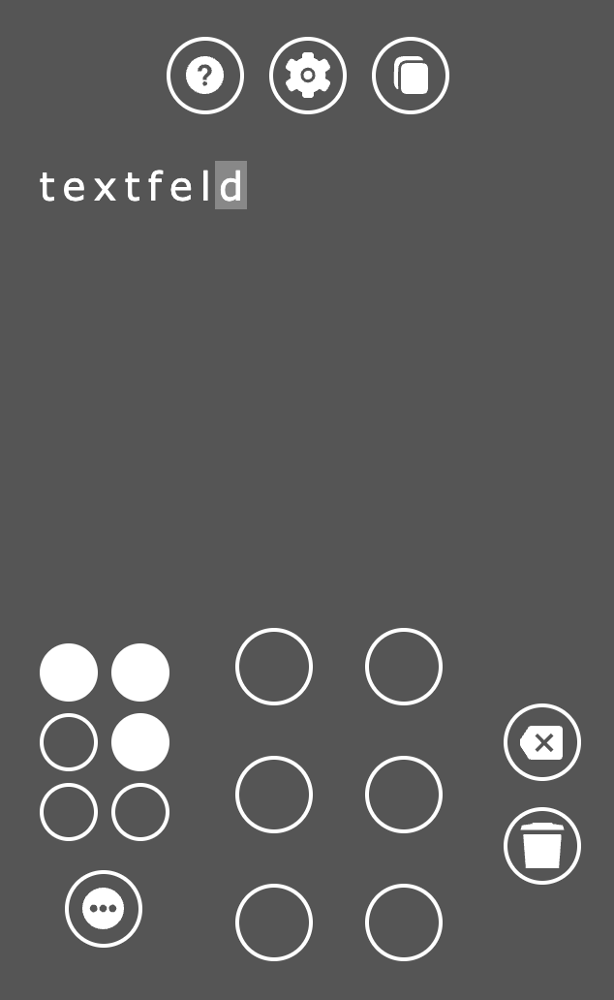

# Braille

Die Webseite kann Blindenschrift, sogenannte Brailleschrift übersetzen.
Mit ihr kann Basis- und deutsche Vollschrift in Schwarzschrift übersetzt werden.
Auch deutsche Kurzschriftzeichen, die nur aus einem Braillezeichen bestehen, können übersetzt werden.

## Bedienung

Es gibt zwei Braille-Felder - ⠿ - „6er“ genannt.

Zeichne mit der linksgedrückten Maus ein Braillezeichen auf dem großen 6er. Das Zeichen wird übersetzt im Textfeld angezeigt und selektiert.

Selektierte Zeichen werden im kleinen 6er angezeigt. Mit Klick können dort einzelne Punkte korrigiert und die Übersetzung im Textfeld angepasst werden.

Mit dem Knopf „Alternative Zeichen“ (3-Punkte-Symbol unter dem kleinen 6er) können die alternativen Übersetzungen angezeigt werden.

### Tastatur

Es gibt einen sogenannten Steno-Maschinen-Modus.
Die Braille-Punkte 1 - 6 werden mit den Tasten `S`, `D`, `F`, `J`, `K`, `L` erzeugt.
Dazu drücke die benötigten Punkte/Buchstaben gleichzeitig.

Weitere Tasten:
- `Backspace`: letztes Zeichen löschen
- `ESC`: alle Zeichen löschen
- `Space`: Leerzeiche setzen
- `<`: alternative Zeichenübersetzung anzeigen

## Optionen

- Vollschrift bevorzugen
  - Die Übersetzung des Textes soll zuerst die Vollschrift-Zeichen anzeigen (default). Ansonsten werden die Kurzschrift-Zeichen bevorzugt.
- Text lokal speichern
  - Der übersetzte Text soll ein Neuladen überstehen und wird deshalb auf dem Gerät gespeichert.

## Hinweise

- Die Raute (\#) bedeutet in der Brailleschrift das Zahlenzeichen. Die direkt nachfolgenden Zeichen für a - j sind nun die Ziffern 1 - 0.
- Nach dem Zahlenzeichen (\#) um eine Reihe nach unten verschobene a - j bedeuten die Ordungsziffern (1., 2. usw.).

## Einschränkungen

Mit der Webseite können fast alle Beschriftungen im öffentlichen Raum übersetzt werden, da es sich dort meist um Basisschrift handelt, die sich international kaum unterscheidet, solange es sich um lateinische Buchstaben handelt.
Auch auf Verpackungen von Produkten wird meist Basisschrift verwendet.

Texte im privaten Raum oder in Büchern werden jedoch meist in Voll- oder Kurzschrift verfasst.
Diese Braillezeichen haben national unterschiedliche Bedeutungen.
Auf dieser Webseite sind die deutschen Vollschrift-Zeichen benutzt worden.
Die deutsche Kurzschrift ist nur in Teilen umgesetzt.
Alle Kurzschriftzeichen, die nur aus einem Zeichen bestehen, können übersetzt werden.

Weitere Erklärungen zu den Zeichen: [de.wikipedia.org/wiki/Brailleschrift#Codetabelle für die deutsche Sprache](https://de.wikipedia.org/wiki/Brailleschrift#Codetabelle_f%C3%BCr_die_deutsche_Sprache)

## Glossar

<dl>
<dt>Brailleschrift</dt>
<dd>Die Brailleschrift ist eine Blindenschrift, die international von Blinden und stark Sehbehinderten benutzt wird.
Die Schrift besteht aus Punktmustern, denen ein System von sechs Punkten zugrunde liegt, die meist von der Rückseite her in das Papier eingedrückt werden und somit von vorne als Erhöhungen mit den Fingerspitzen zu ertasten sind.</dd>

<dt>Schwarzschrift</dt>
<dd>Der Begriff Schwarzschrift wird zur Bezeichnung einer Schrift für Sehende zur Unterscheidung von Blindenschrift verwendet.
Die Bezeichnung stammt daher, dass ursprünglich zum Schreiben und Drucken fast ausschließlich schwarze Tinte und als Träger weißes Papier verwendet wurden.</dd>

<dt>Basisschrift</dt>
<dd>Hier entspricht im Allgemeinen jeder Buchstabe einem Braillezeichen.
Es gibt nur Kleinbuchstaben, weswegen Großbuchstaben, Ziffern oder Akzentbuchstaben durch Voranstellen bestimmter Zeichen zu solchen erklärt werden.
</dd>

<dt>Vollschrift</dt>
<dd>Acht Buchstabengruppen der deutschen Sprache (au, ei, eu, äu, ie, ch, sch, st) werden durch eigene Braillezeichen ersetzt.
Dadurch verkürzt sich der Text gegenüber der Basisschrift um etwa 5 % bis 10 %.</dd>

<dt>Kurzschrift</dt>
<dd>Die Kurzschrift ist vergleichbar mit der Stenografie in der Schwarzschrift.
Es werden einzelne Buchstaben und Buchstabenkombinationen für häufig benutzte Worte benutzt und Silben oder Wortteile nach bestimmten Kürzungs-Regeln durch Kombinationen mit Buchstaben oder auch Sonderzeichen gekürzt (z. B. steht u für und).
Der Text wird dabei um etwa 30 % bis 40 % gegenüber der Vollschrift verkürzt.
Geübte Blinde können diese Kurzschrift fast im selben Tempo lesen wie Sehende Schwarzschrift.</dd>
</dl>

Quelle: [Wikipedia](https://de.wikipedia.org/wiki/Brailleschrift)
